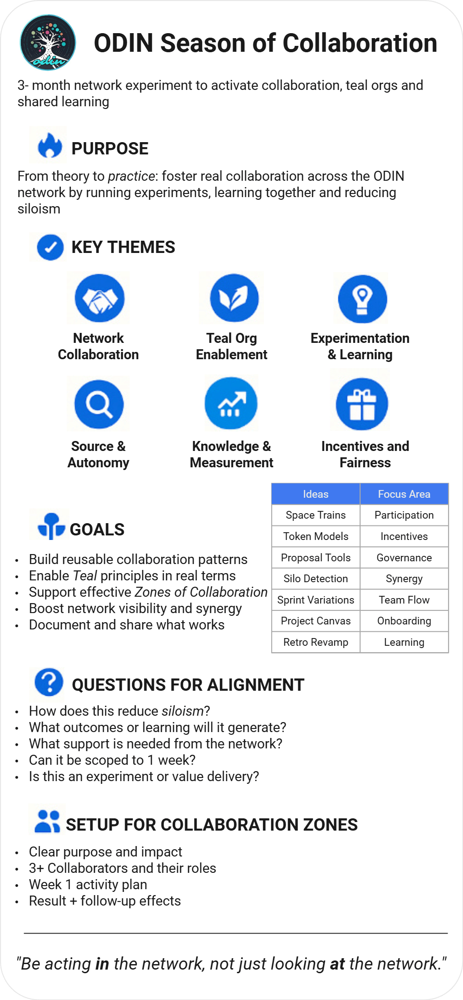

*June → August 2025  ·  Short, focused, and fun*

:::tip
Join us on the [ODIN Discord](https://discord.gg/8qXvqH9vG4) and complete the [ODIN Season of Collaboration 2025 course on Andamio](https://app.andamio.io/course/4c9db78cd0c827569a9660ecd9fd0f8687ca3f762a97ec685519548c/101/lesson/1)
:::

---
## Why (Purpose)
Put our *teal‑style* governance, collective skills, and diverse forms of capital to work on real, bite‑sized experiments that strengthen decentralized operations and create visible value for the wider Cardano & open‑source community.

## What (Scope)
- **Micro‑sprints** of **5 days**  
- 1–2 work‑in‑progress experiments at any moment  
- Concrete deliverables (code, docs, site, tokenomics prototype, etc.)  
- Rapid consent‑based decisions, quick feedback loops

## Possible Ideas
| Idea                                     | Quick win                                                            |
| ---------------------------------------- | -------------------------------------------------------------------- |
| **Collaborative Sparks website**         | Publish a knowledge hub for self‑management & collaboration patterns |
| **Self‑Management & Collaboration blog** | Launch and seed first articles                                       |
| **Tokenomics / incentive prototype**     | Test small‑scale reward mechanics on Cardano pre‑prod                |
| **Other suggestions welcome**            | Propose during ODIN General meeting on Monday                                       |

*(Frame your idea via the `Proposal` template.)*

### How We Work

| Tool / Space                    | Primary use in the Season of Collaboration                                                      |
| ------------------------------- | ----------------------------------------------------------------------------------------------- |
| **Google Docs**                 | Living docs: proposal drafts, working notes, and the **async retrospective form**               |
| **Discord**                     | Daily text stand-ups and threaded discussions (quick questions, nudges)                         |
| **Google Meet**                 | Two short synchronous meetings each week (Monday kickoff · Friday demo/retro)                   |
| **Google Gemini** _(notetaker)_ | Auto-captures Meet transcripts and action items; notes are dropped into the shared Google Drive |

:::note
Flow in a sentence: Google Docs captures the narrative; Discord provides real-time touch points; Google Meet + Gemini handle the synchronous moments and clean notes.
:::
## Sprint Rhythm

1. **Sprint Planning** (90 min) — Monday ODIN meeting -  choose next experiment(s), define "Done" & decide rewards.  
2. **Daily Check‑ins** (15 min) - on Discord.  
3. **Sprint Review & Retro** (async) — demo results, capture learnings, .  
4. **Repeat** until end of August.

## Roles (lightweight)

- **Cultivator** (rotates) — keeps board tidy, hosts meetings.
- **Harvester** (rotates)  - Collects value generated and presents in the Retro
- **Contributors** — grab tasks, open PRs, request help openly.  

## Getting Started

1. **Join the Discord** → accept invite.  
2. **Read the open proposals** in the Google Drive.  
3. **Add yourself to the Contributors list** in the Google Drive.  
4. **Comment or open a proposal issue** if you have an experiment idea.  
5. **Jump into Sprint Planning call** (see calendar at [ODIN.ECO](https://odin.eco))!

---

*Let’s learn fast, build useful things, and have some fun!* 